# HP3PAR Installation and Deployment with Integration of Packstack-10/RHOSP-10/RHOSP-13

Tested and working on all above Openstack Environemnt.

## Warning

For RHOSP-13, HP3Par lefthand is not supported as its a containerized environment.
There are some tweak to make it work.

We will not take you throught the process of Packstack-10/OSP10/13 installation.


What's included
---------------
* Hp3Par Installtion on KVM
* Static IP Configuration of Hp3Par
* CMC Installtion on Lubuntu (as CMC required GUI, we decided to take light weight GUI)
* Connect CMC with Hp3Par
* User Management, RAID Creation,
* Integration of Hp3Par with Openstack (Packstack-10/RHOSP-10 & RHOSP-13)
* Testing

Prerequisites
--------------------------
* To Begin with installation make sure you fulfill the following prerequisites
  - Minimum of one node to add into cluster
  - Node Specifications: 4Gb RAM, 3*10GB Disk(which should be added once VSA node is ready)
  - Hpe LeftHand setup tar file
    - HPE_StoreVirtual_KVM_VSA_and_StoreVirtual_FOM_Installer_TA688-10554.tgz

Hp3Par Installation steps
--------------------------
~~~
Overview
~~~

~~~
Install HPE StoreVirtual VSA on ANY new server from ANY server vendor.** StoreVirtual VSA transforms unused capacity inside your servers into a shared storage array.
You get fully featured shared storage without the cost and complexity of dedicated storage hardware.
Register now and try HPE software-defined storage for free for 3 years.
Your license will be activated when you install the software.

NOTE: StoreVirtual VSA performs optimally when you install the same software version on every server in the management group.
Previously installed free versions of StoreVirtual VSA software can be upgraded with the purchase of a full license.

New customers:

    Download the latest HPE StoreVirtual Free 1TB VSA
~~~

###Begin Installation

* First Check if you enough space for /var/lib/libvirt/images atleast of 150GB

    

* If not check for the size on /home, For example in my case I have only 50GB for my partition and 2.7T on my /home

* Create a directory named images inside /home and run all the commands given below

    ```
    cd /var/lib/libvirt
    rm -rf images
    mkdir /home/images
    chcon -t virt_image_t /home/images
    ln -s /home/images .
    ```

* Inside /home/images extract your HPE_StoreVirtual_KVM_VSA_and_StoreVirtual_FOM_Installer_TA688-10554.tgz

    ~~~
    tar -xvf HPE_StoreVirtual_KVM_VSA_and_StoreVirtual_FOM_Installer_TA688-10554.tgz
    ~~~
* Then extract KVM-VSA-12.7.00.0226_01.img.tgz which you get after running the above command.

    ~~~
    tar -xvf KVM-VSA-12.7.00.0226_01.img.tgz
    ~~~
* Open the virt-manager of you base machine.
* Click on File → New Virtual Machine
* Choose Fourth option `Import existing disk image` and then click on *Forwad*
* Click on File->New Virtual Machine

    
* Choose Fourth option `Import existing disk image` and then click on *Forwad*

    

    

* Input the value of ram and cpus
* It will take upto 15 - 20 minutes to setup the machine.
* Once you get the login screen type *start* and press *enter*, you will get the below screen.

    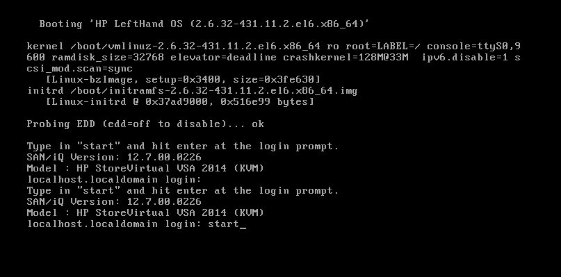
* Press *Enter* to login

    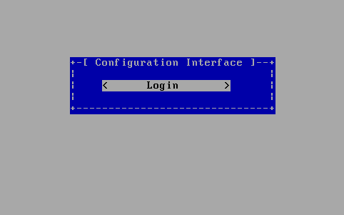

* Go in *Network TCP/IP Settings*

    

* Hit enter and select 2nd option to get ip automatically from dhcp, you can also set ip manual if you want

    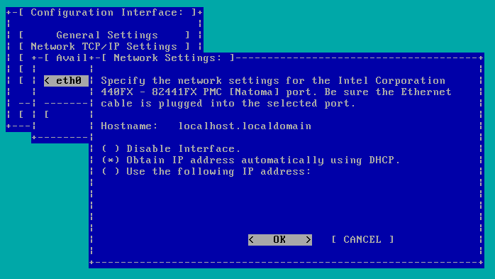
* Press *Enter*

    

* Finally you will get the. This ip needs to be given in CMC which we will see further

    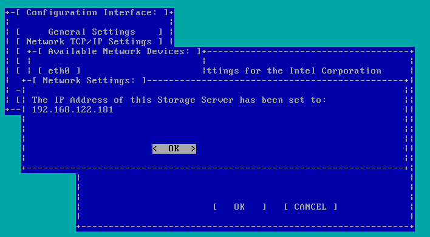

CMC Installation steps
--------------------------
* Open your lubuntu session
    - Make Sure you have CMC bin file with you
        ~~~
         HPE_StoreVirtual_Centralized_Management_Console_for_Linux_64_bit_BM480-10622.bin
        ~~~
* Run the binary file you will see the following window

    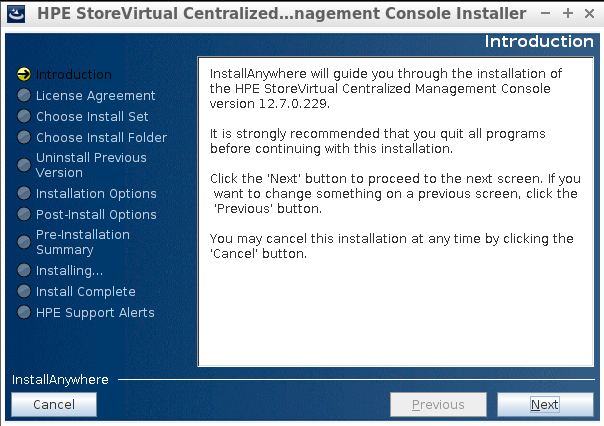
* Click on next
* Accept the license agreement

    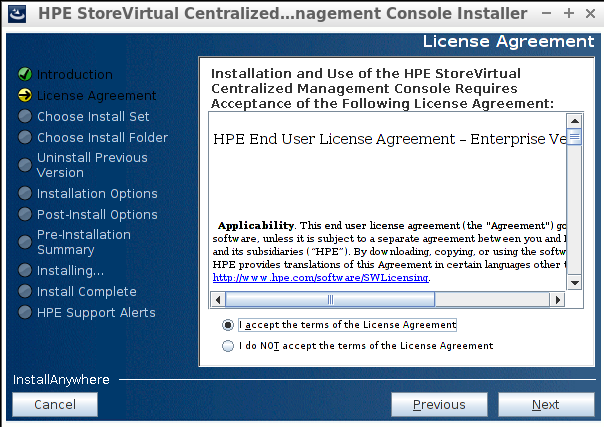
* Go with typical installation set

    
* Just go on clicking next

    

    

    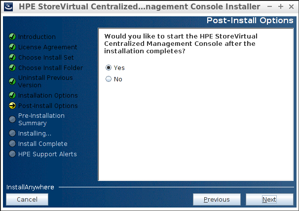

    

    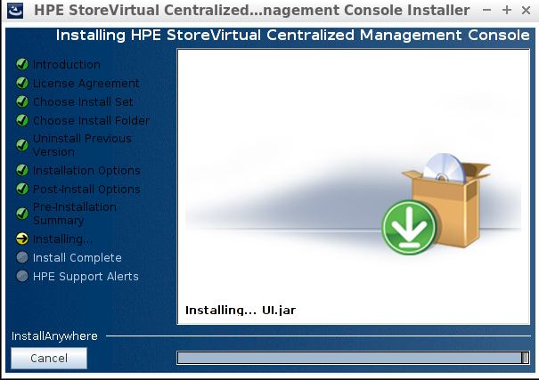

    

    


* Go to the directory /opt/HPE/StoreVirtual/UI/

    
* Hit the following command

    ~~~
    ./HPE\ StoreVirtual\ Centralized\ Management\ Console
    ~~~
* The CMC Window will open, it looks like the below figure

    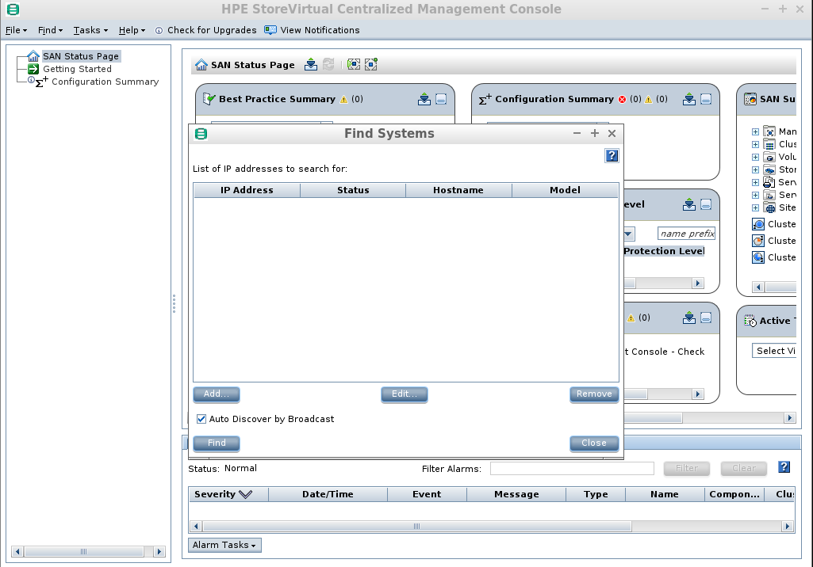

* Click on Add and enter the VSA node ip address

    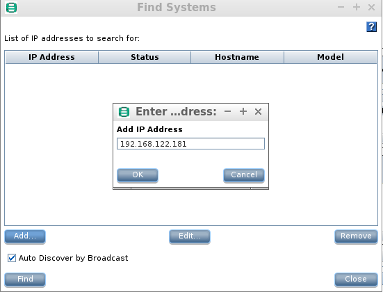

    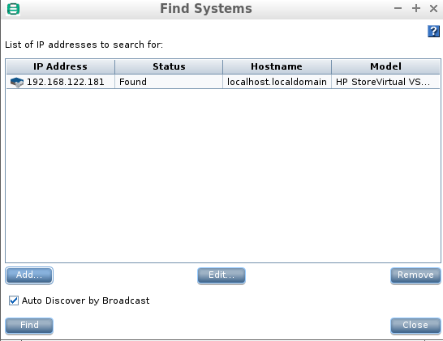
* Now click on `Getting Started` at left side

    

* Click next

    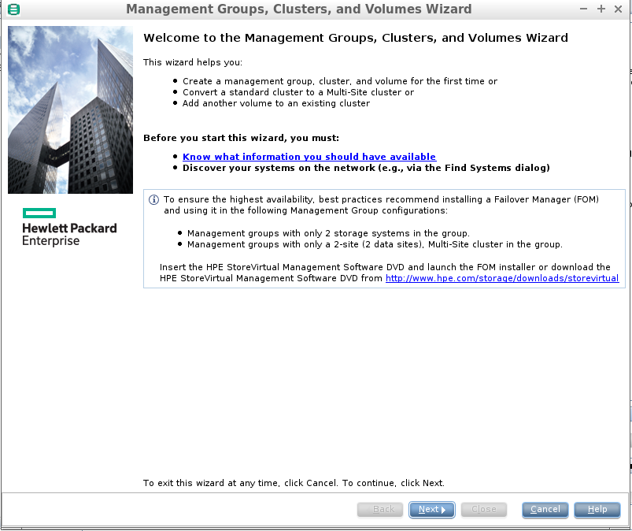

* Create New Management Group

    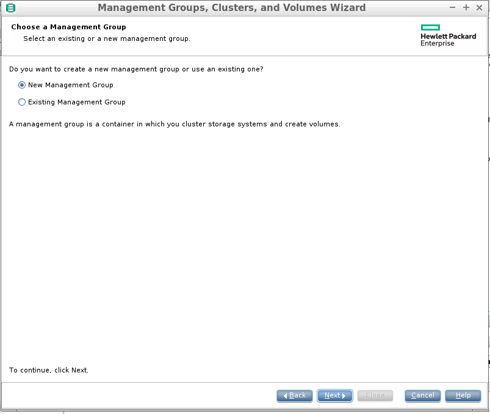
* Add management group name

    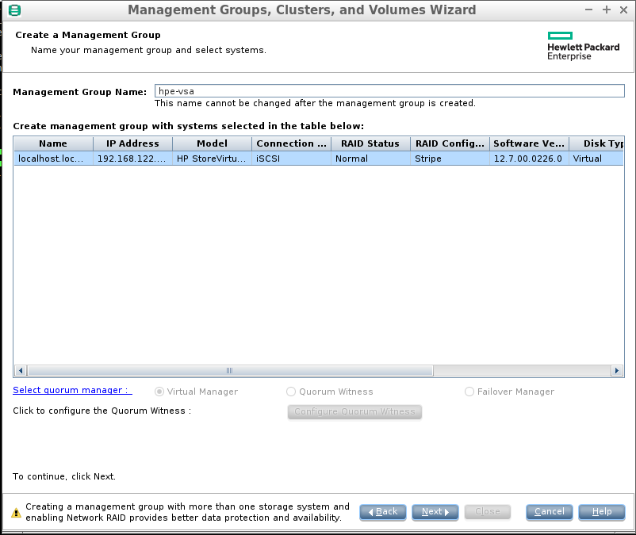

* Create user and set password for the user

    

* Add ntp server ip address in next window

    

    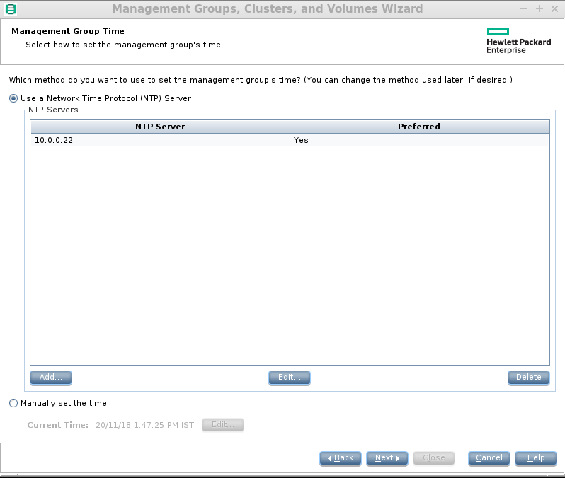

* Add DNS Server

    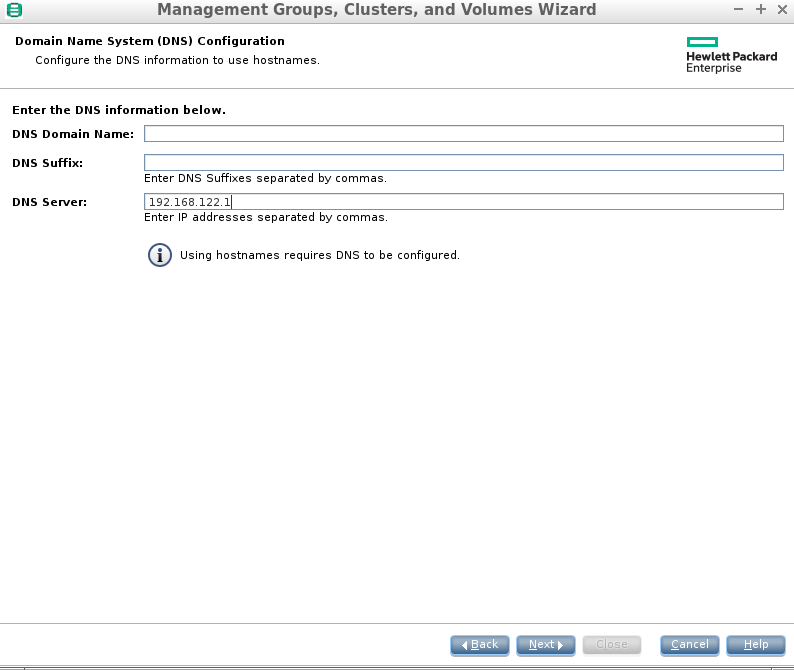

* Enter the mail server ip address/domain
    - [Note: In my case I have given dummy information]

    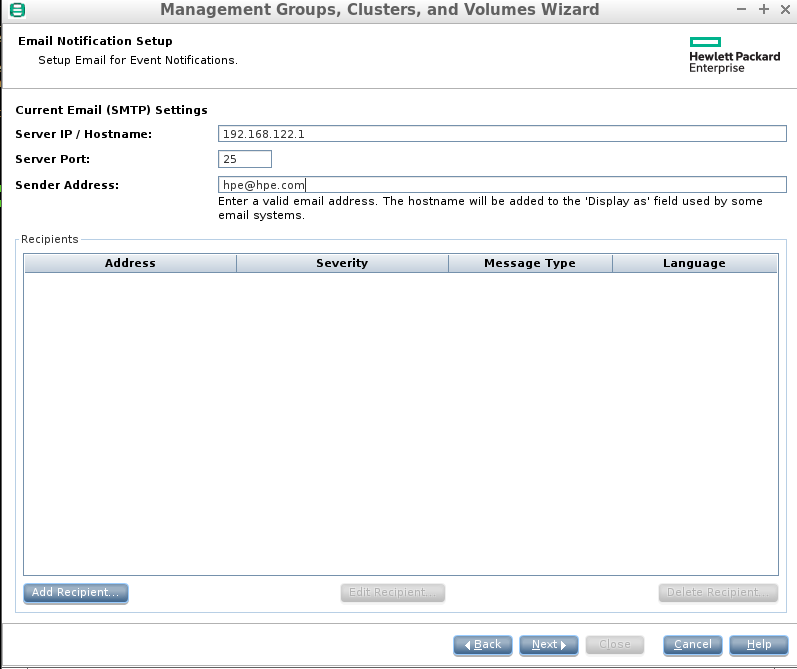

    

    

* Select the type of cluster I do not have `multi-site` so going for     `standard`

    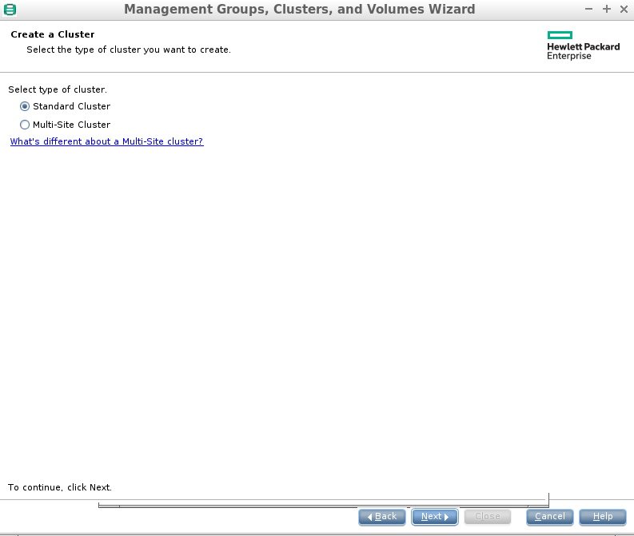

* Enter the Cluster name over there

    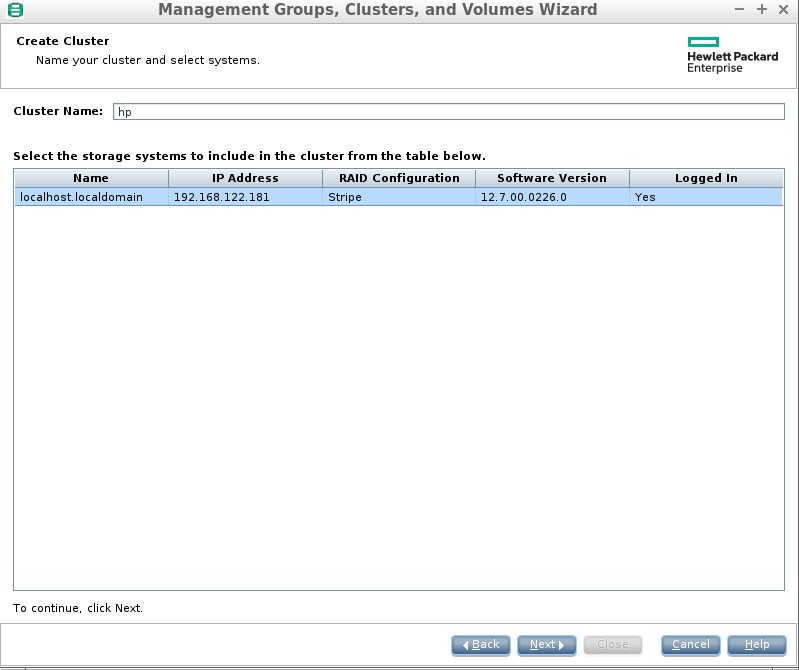

* Now its time to enter the virtual ip, you virtual ip should be reachable from any instance in same network

    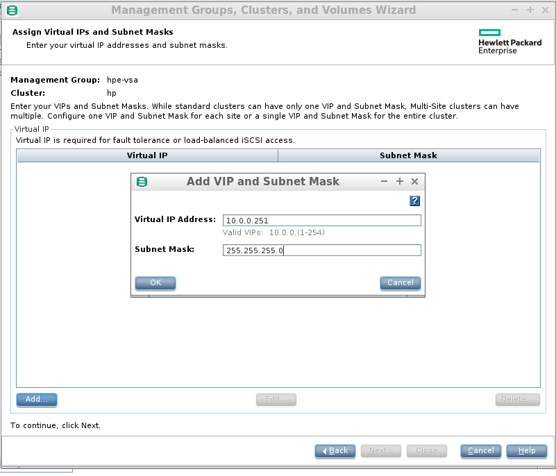

* Enter all the required details

    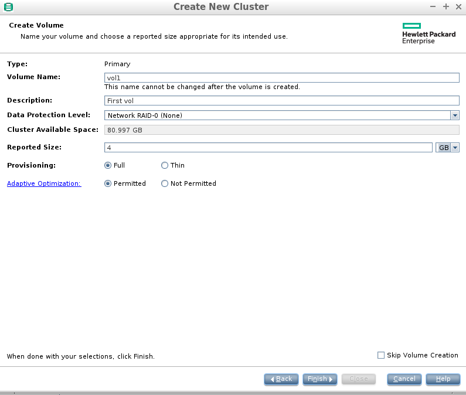


* Wait for some time since it takes time to create a management group

    

* You will get something like this

    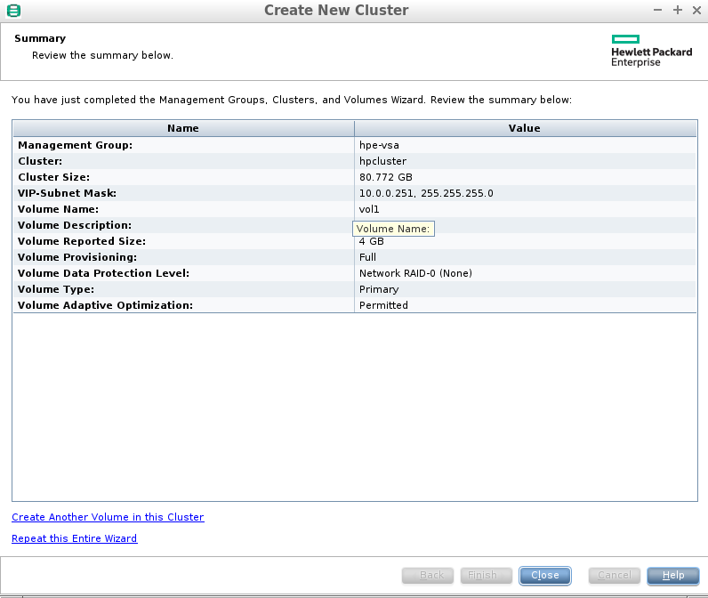


* You can see your cluster at the left side of panel

    


Integration with Openstack Environemnt :-
------------------------------------------
As openstack is widely used cloud product.So it becomes necessary to have storage backened attached to our environment. Openstack supports various storage providers drivers. One of them is hpe3par/hpelefthand.
We might face challenges in intergatin those storages with our environments. This document will guide you how to integrate hpelefthand with Packstack, RHOSP10 and RHOSP13.


The templates for RHOSP10 and RHOSP13 is uploaded on this repository.
Also cinder.conf for packstack is uploaded too.

~~~
To run openstack commands for any component in RHOSP10 and RHOSP13 source overcloudrc file
To restart any service in RHOSP13 check the container id on controller node and restart container
`docker restart container_id`
To run openstack commands for any component in Packstack source `keystonerc_admin` file
~~~

Following are the steps important drivers need to installed in your environment to enable hpelefthand.

~~~
# yum install https://dl.fedoraproject.org/pub/epel/epel-release-latest-7.noarch.rpm -y
# yum install python-pip -y
# pip install --upgrade pip
# pip install 'python-lefthandclient>=2.1,<3.0'
~~~

Where to install above driver is explained in detail according to the environment.

Packstack Integration :-
------------------------
 * If you have packstack deployed environment, its become easy to integrate hpelefthand with it.
 * The only thing you need to do is edit cinder.conf and install hpelefthand client on packsatck node.
 * Below are steps to integrate hpelefthand with packstack
~~~
# vi /etc/cinder/cinder.conf
~~~
* Add the following lines and change values as per your environment

    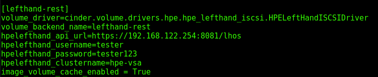

* Also enable hpeleftand as backened in cinder.conf

     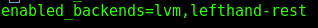

* Install the drivers of hpelefthand client as you can in above section.

* Restart the cinder-volume service
~~~
systemctl restart openstack-cinder-volume
~~~

* Then check cinder service list after sourcing keystone_admin file

RHOSP-10 Integration :-
-----------------------
* I haved installed RHOSP10 using director.
* In RHOSP10 we have all services as systemd service

* To integrate hpelefthand with rhosp10 we need to create customize templates the templates for osp10 is loaded on this repo have a look on it

* Check the contents of custom-env.yaml file in rhosp13_hpelefthand.tar
* Make necessry changes as your environment and include this environment file in your deployment command (** for reference check deploy.sh script given in the tar**).
* Hit the deployment command
* Once your deployment is complete to undercloud and source overcloudrc file.
    ~~~
    $ source overcloudrc
    ~~~
* Then check the cinder services
    ~~~
    $ cinder service-list
    ~~~
    - If you see that your your hpelefthand down, like below output
    ~~~
+------------------+----------------------------+------+---------+-------+----------------------------+-----------------+
| Binary           | Host                       | Zone | Status  | State | Updated_at                 | Disabled Reason |
+------------------+----------------------------+------+---------+-------+----------------------------+-----------------+
| cinder-scheduler | hostgroup                  | nova | enabled | up    | 2018-11-28T06:55:18.000000 | -               |
| cinder-volume    | hostgroup@tripleo-lefthand | nova | enabled | down  | 2018-11-28T06:55:23.000000 | -               |
| cinder-volume    | hostgroup@tripleo_iscsi    | nova | enabled | down  | 2018-11-27T10:57:28.000000 | -               |
+------------------+----------------------------+------+---------+-------+----------------------------+-----------------+

    ~~~
* Then go on controller node and install pip over that node
~~~
# yum install https://dl.fedoraproject.org/pub/epel/epel-release-latest-7.noarch.rpm -y
# yum install python-pip -y
# pip install --upgrade pip
# pip install 'python-lefthandclient>=2.1,<3.0'
~~~

* In above commands we can see that we install python-hpe client because if your check cinder-volume logs you will find an error msg for hpelefthand driver not installed

~~~
# less /var/log/cinder/volume.log
~~~

* Restart cinder volume service so to apply the latest changes

~~~
# systemctl restart openstack-cinder-volume
~~~

* Then Again if you check that cinder service list you will see the cinder-volume service is up for hpelefthand

~~~
+------------------+----------------------------+------+---------+-------+----------------------------+-----------------+
| Binary           | Host                       | Zone | Status  | State | Updated_at                 | Disabled Reason |
+------------------+----------------------------+------+---------+-------+----------------------------+-----------------+
| cinder-scheduler | hostgroup                  | nova | enabled | up    | 2018-11-28T07:22:08.000000 | -               |
| cinder-volume    | hostgroup@tripleo-lefthand | nova | enabled | up    | 2018-11-28T07:22:13.000000 | -               |
| cinder-volume    | hostgroup@tripleo_iscsi    | nova | enabled | down  | 2018-11-27T10:57:28.000000 | -               |
+------------------+----------------------------+------+---------+-------+----------------------------+-----------------+
~~~

#####[Note: I have kept my lvm service down thats why its shows hostgroup@tripleo_iscsi down in your case it might be up]


RHOSP-13 Integration :-
-----------------------
* In RHOSP13 we have defaults templates at /usr/share/openstack-tripleo-heat-templates/environments
~~~
/usr/share/openstack-tripleo-heat-templates/environments/cinder-hpelefthand-config.yaml
~~~

* Copy that file in /home/stack/templates/

~~~
(overcloud) [stack@undercloud environments]$ cp cinder-hpelefthand-config.yaml /home/stack/templates/
~~~

* Change the values in `cinder-hpelefthand-config.yaml` as per your cluster

~~~
resource_registry:
  OS::TripleO::Services::CinderHPELeftHandISCSI: /usr/share/openstack-tripleo-heat-templates/puppet/services/cinder-hpelefthand-iscsi.yaml

parameter_defaults:
  CinderHPELeftHandISCSIApiUrl: 'https://192.168.122.110:8081/lhos'
  CinderHPELeftHandISCSIUserName: 'hpe'
  CinderHPELeftHandISCSIPassword: 'hpe12345'
  CinderHPELeftHandISCSIBackendName: 'tripleo_hpelefthand'
  CinderHPELeftHandISCSIChapEnabled: false
  CinderHPELeftHandClusterName: 'hp'
  CinderHPELeftHandDebug: True
~~~

* In RHOSP13 we have containerized overcloud.
* So before deployment we need to modify cinder-volume container
* Follow the steps given below

~~~
$ cd /home/stack/
$ mkdir cinder-hpe
$ cat Dockerfile
FROM 192.0.2.1:8787/rhosp13/openstack-cinder-volume:13.0-62
USER root
RUN sudo  curl -O http://dl.fedoraproject.org/pub/epel/epel-release-latest-7.noarch.rpm
RUN sudo rpm -ivh epel-release-latest-7.noarch.rpm
RUN sudo yum install -y python-pip --skip-broken
RUN sudo pip install --upgrade pip
RUN sudo pip install 'python-lefthandclient'
~~~
Search for cinder-volume in overcloud_images.yaml, copy the full path and write it in Dockerfile near `FROM` section

* This Dockerfile will install hpelefthand client inside cinder-volume container.
* Run the following commands and modify according to your environment.
~~~
$ docker build --rm -t 192.0.2.1:8787/rhosp13/openstack-cinder-volume:workaround /home/stack/cinder-hpe
$ docker push 192.0.2.1:8787/rhosp13/openstack-cinder-volume:workaround
$ docker images | grep workaround
~~~

* Now open overcloud_images.yaml and replace the image path to workaround
~~~
 DockerCinderSchedulerImage: 192.0.2.1:8787/rhosp13/openstack-cinder-scheduler:13.0-64
 DockerCinderVolumeImage: 192.0.2.1:8787/rhosp13/openstack-cinder-volume:workaround
 DockerClustercheckConfigImage: 192.0.2.1:8787/rhosp13/openstack-mariadb:13.0-61
~~~

* Run the deployment command now including the `cinder-hpelefthand-config.yaml` environment file.

~~~
openstack overcloud deploy --templates -e /home/stack/templates/node-info.yaml -e /home/stack/templates/overcloud_images.yaml -e /usr/share/openstack-tripleo-heat-templates/environments/network-isolation.yaml -e /home/stack/templates/network-environment.yaml -e /home/stack/templates/cinder-hpelefthand-config.yaml --ntp-server 192.0.2.1
~~~

* Lets create a volume and attach it to instance

* Initially there is no volume created other than system reserved

    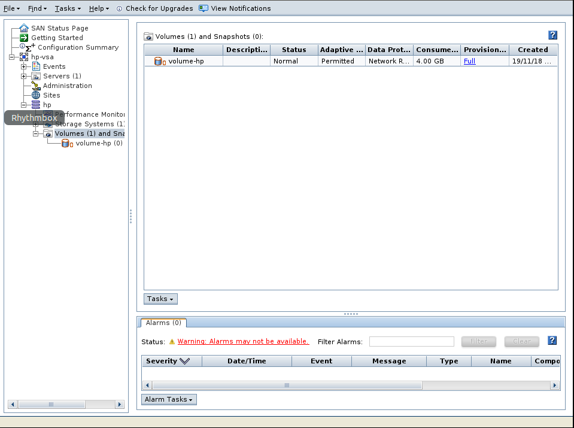

* Lets Create a volume of 5GB

    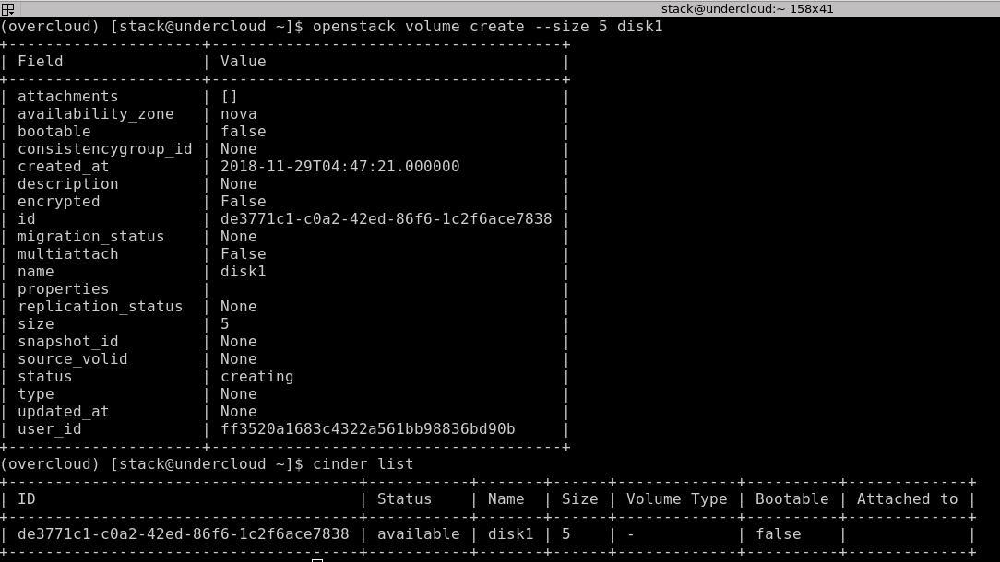

    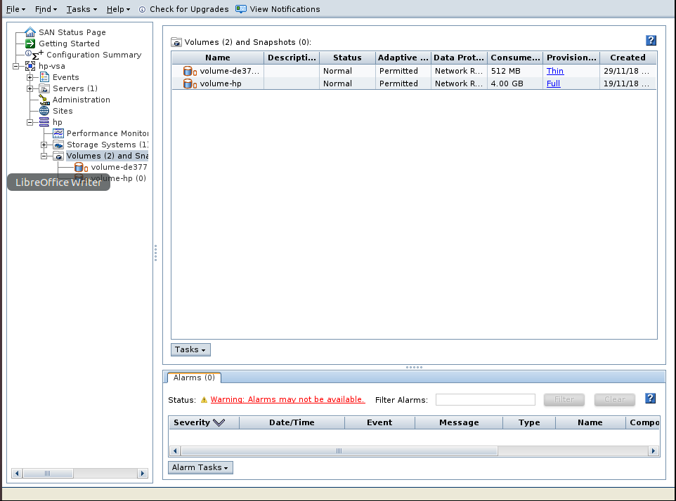

* Create an instance and verify there is no volume attached

    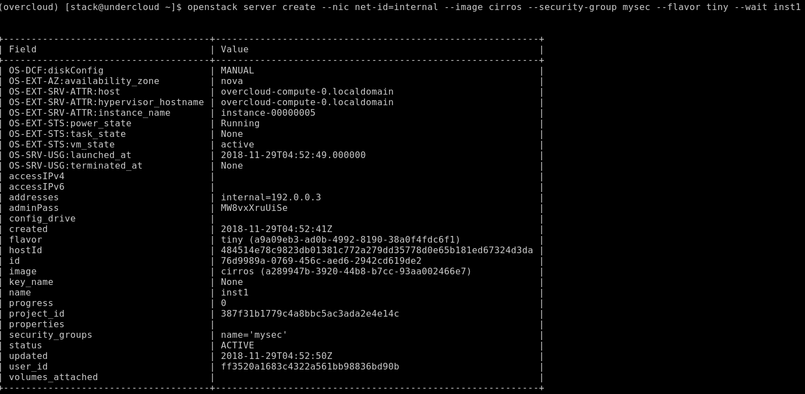

* Now attach a volume to an instance

    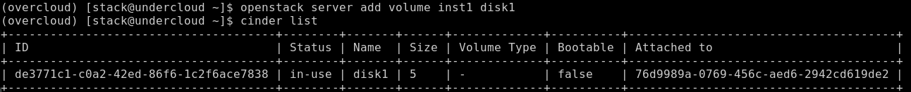

    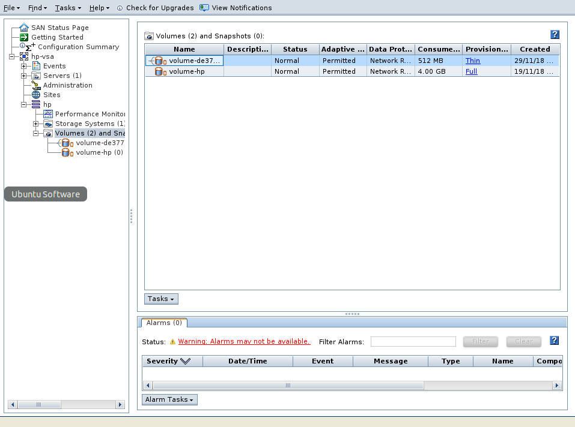

* ssh into an instance and mount the attached volume to an instance

  In my case it is cirros instance and it has floating ip `192.168.122.116`

~~~
$ ssh cirros@192.168.122.116
~~~

* Once you get into he instance hit following commands to attach a volume

~~~
$ sudo -i
# lsblk
~~~

 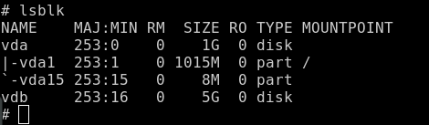

~~~
# mkdir /data
# mkfs.ext4 /dev/vdb
# mount /dev/vdb /data/
~~~
 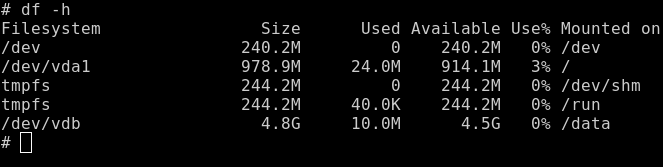

* Lets add some data inside that attached volume

    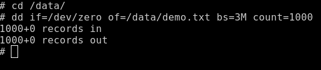

    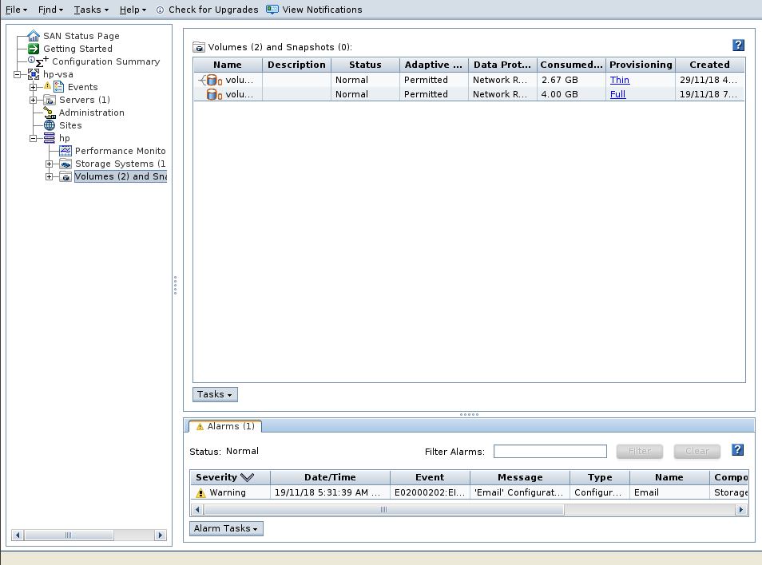

###### We can see that size of used space increased.


