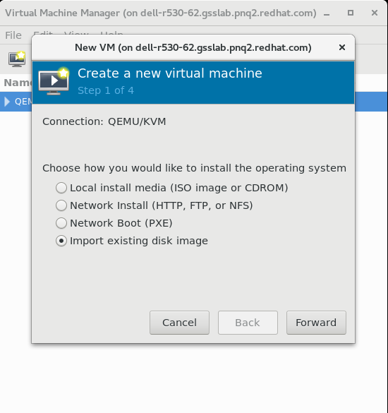
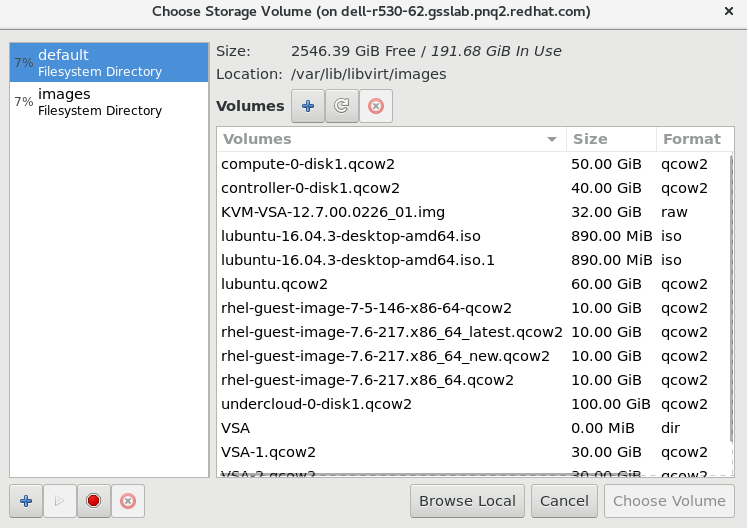

# HP3PAR Installation and Deployment with Integration of Packstack-10/RHOSP-10/RHOSP-13

Tested and working on all above Openstack Environemnt.

## Warning

For RHOSP-13, HP3Par lefthand is not supported as its a containerized environment.
There are some tweak to make it work.

We will not take you throught the process of Packstack-10/OSP10/13 installation.


What's included
---------------
* Hp3Par Installtion on KVM
* Static IP Configuration of Hp3Par
* CMC Installtion on Lubuntu (as CMC required GUI, we decided to take light weight GUI)
* Connect CMC with Hp3Par
* User Management, RAID Creation,
* Integration of Hp3Par with Openstack (Packstack-10/RHOSP-10 & RHOSP-13)
* Testing

Prerequisites
--------------------------
* To Begin with installation make sure you fulfill the following prerequisites
  - Minimum of one node to add into cluster
  - Node Specifications: 4Gb RAM, 3*10GB Disk(which should be added once VSA node is ready)
  - Hpe LeftHand setup tar file
    - HPE_StoreVirtual_KVM_VSA_and_StoreVirtual_FOM_Installer_TA688-10554.tgz

Hp3Par Installation steps
--------------------------
~~~
Overview
~~~

~~~
Install HPE StoreVirtual VSA on ANY new server from ANY server vendor.** StoreVirtual VSA transforms unused capacity inside your servers into a shared storage array.
You get fully featured shared storage without the cost and complexity of dedicated storage hardware.
Register now and try HPE software-defined storage for free for 3 years.
Your license will be activated when you install the software.

NOTE: StoreVirtual VSA performs optimally when you install the same software version on every server in the management group.
Previously installed free versions of StoreVirtual VSA software can be upgraded with the purchase of a full license.

New customers:

    Download the latest HPE StoreVirtual Free 1TB VSA
~~~

###Begin Installation

* First Check if you enough space for /var/lib/libvirt/images atleast of 150GB


* If not check for the size on /home, For example in my case I have only 50GB for my partition and 2.7T on my /home

* Create a directory named images inside /home and run all the commands given below

    ```
    cd /var/lib/libvirt
    rm -rf images
    mkdir /home/images
    chcon -t virt_image_t /home/images
    ln -s /home/images .
    ```

* Inside /home/images extract your HPE_StoreVirtual_KVM_VSA_and_StoreVirtual_FOM_Installer_TA688-10554.tgz

    ```tar -xvf HPE_StoreVirtual_KVM_VSA_and_StoreVirtual_FOM_Installer_TA688-10554.tgz```
* Then extract KVM-VSA-12.7.00.0226_01.img.tgz which you get after running the above command.

    ```tar -xvf KVM-VSA-12.7.00.0226_01.img.tgz```
* Open the virt-manager of you base machine.
<<<<<<< Updated upstream
* Click on File → New Virtual Machine
* Choose Fourth option `Import existing disk image` and then click on *Forwad*
* Click on File->New Virtual Machine

    
* Choose Fourth option `Import existing disk image` and then click on *Forwad*

    

    

* Input the value of ram and cpus
* It will take upto 15 - 20 minutes to setup the machine.
* Once you get the login screen type *start* and press *enter*, you will get the below screen

CMC Installation steps
--------------------------


Integration with Openstack Environemnt :-
------------------------------------------


Packstack Integration :-
------------------------


RHOSP-10 Integration :-
-----------------------


RHOSP-13 Integration :-
-----------------------

